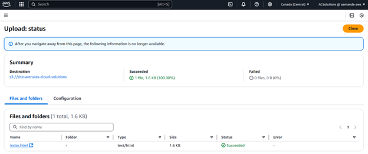
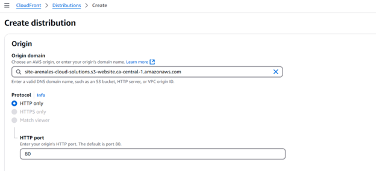
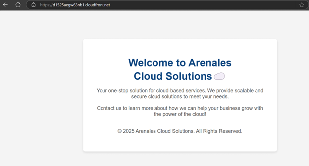

# 🌐 Static Website Hosting on AWS with S3, CloudFront & HTTPS

In this project, I deployed a scalable, secure, and cost-effective static website on AWS.

> A modern landing page hosted entirely using AWS services: **S3 for storage** and **CloudFront for CDN delivery**. Built for speed, reliability, and zero server maintenance.

---

## 🎯 Project Goals

- ✔️ Host a static business website (HTML/CSS/JS)
- ✔️ Make it publicly accessible and secure
- ✔️ Serve via HTTPS with CDN performance
- ✔️ Use AWS-native services only
- ✔️ Zero cost under Free Tier

---

## 🛠️ Tech Stack

| Service         | Description                                                                 |
|----------------|-----------------------------------------------------------------------------|
| **Amazon S3**   | Stores the website files and serves them via static website hosting        |
| **CloudFront**  | Distributes content via CDN, adds HTTPS and custom domain support          |

---

## 🚀 Step-by-Step Deployment Guide

### 1️⃣ Create an S3 Bucket

- Created a **S3 Bucket** named `site-arenales-cloud-solutions`
- Enabled **Static Website Hosting**
- Allowed public access to the bucket



---

### 2️⃣ Bucket Policy for Public Read Access

Applied the following bucket policy:

```json
{
  "Version": "2012-10-17",
  "Statement": [{
    "Sid": "PublicRead",
    "Effect": "Allow",
    "Principal": "*",
    "Action": "s3:GetObject",
    "Resource": "arn:aws:s3:::site-arenales-cloud-solutions/*"
  }]
}
```

### 3️⃣ CloudFront Distribution
Used to ensure the website loads faster with HTTPS and automatic caching across AWS Edge Locations:

- Origin domain: site-arenales-cloud-solutions.s3.ca-central-1.amazonaws.com
- Origin access: Public bucket
- Protocol policy: Redirect HTTP to HTTPS



### 🌍 Final Result
- 📌 Distributed via CloudFront:
- 👉 https://d1525aegw63nb1.cloudfront.net/



### 🧠 Key Learnings
- How to configure S3 for public static hosting
- Granting secure read-only access to bucket content
- Using CloudFront for global delivery and HTTPS
- Importance of clean front-end architecture for deployment
